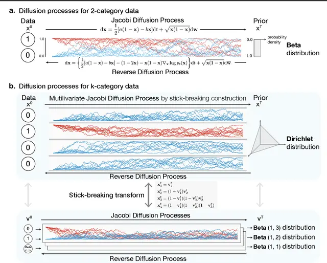

# Dirichlet Diffusion Score Model for Biological Sequence 

[](https://github.com/paulffm/Dirichlet-Diffusion-Score-Model-Reimplementation/blob/main/LICENSE)

Unofficial **PyTorch** reimplementation of the
paper [Dirichlet Diffusion Score Model for Biological Sequence Generation](https://arxiv.org/pdf/2305.10699.pdf)
by Avdeyev et al.

<p align="center">
  
</p>

Figure taken from [paper](https://arxiv.org/pdf/2305.10699.pdf).

## Usage

This implementation provides example notebooks for training and evaluation of DDSM models for Bin-MNIST and MNIST data. In these notebooks you can simply load our provided configs and start training or retraining your models with them as follows:

```python
import os
from lib.models.networks import MNISTScoreNet
import lib.utils.bookkeeping as bookkeeping
from lib.config.config_bin_mnist import get_config

train_resume = False
train_resume_path = 'path/to/saved/models'

if not train_resume:
    config = get_config()
    bookkeeping.save_config(config, config.saving.save_location)

else:
    path = train_resume_path
    date = "date"
    config_name = "config_001.yaml"
    config_path = os.path.join(path, date, config_name)
    config = bookkeeping.load_config(config_path)

model = MNISTScoreNet(ch=config.model.ch, ch_mult=config.model.ch_mult, attn=config.model.attn, num_res_blocks=config.model.num_res_blocks, dropout=0.1, time_dependent_weights=time_dependent_weights)
print("Number of parameters: ", sum([p.numel() for p in model.parameters()]))
optimizer = Adam(model.parameters(), lr=config.optimizer.lr, weight_decay=config.optimizer.weight_decay)
n_iter = 0
state = {"model": model, "optimizer": optimizer, "n_iter": 0}

if train_resume:
    checkpoint_path = config.saving.checkpoint_path
    model_name = 'model_name.pt'
    checkpoint_path = os.path.join(path, date, model_name)
    state = bookkeeping.load_state(state, checkpoint_path, device)
    config.training.n_iter = 100000
    config.sampler.sampler_freq = 5000
    config.saving.checkpoint_freq = 1000

```
A configuration file tailored for generating MNIST data with a U-Net includes the following parameters:

| Parameter                       | Description                                                                  | Type    |
| ------------------------------- | ---------------------------------------------------------------------------- | ------- |
| num_cat                         | Number of categories                                                         | int     |
| n_time_steps                    | Number of time steps                                                         | int     |
| random_order                    | Whether to use random order                                                  | bool    |
| device                          | Device to be used for training                                               | str     |
| speed_balanced                  | Whether to use speed balanced training                                       | bool    |
| use_fast_diff                   | Whether to use fast diffusion                                                | bool    |
| loss                            | Loss configuration                                                           | ConfigDict |
| training.n_iter                 | Number of training iterations                                                | int     |
| training.validation_freq        | Frequency of validation                                                      | int     |
| data.batch_size                 | Batch size used for training                                                 | int     |
| data.image_size                 | Size of the input images                                                     | int     |
| data.num_cat                    | Number of categories in the data                                             | int     |
| data.shape                      | Shape of the data                                                            | tuple   |
| data.use_augmentation           | Whether to use data augmentation                                             | bool    |
| data.num_workers                | Number of workers for data loading                                           | int     |
| data.name                       | Name of the dataset                                                          | str     |
| model.ch                        | Number of channels in the model                                              | int     |
| model.num_res_blocks            | Number of residual blocks                                                    | int     |
| model.attn                      | Attention settings                                                           | list[int]|
| model.ch_mult                   | Channel multipliers                                                          | list[int]|
| model.dropout                   | Dropout rate                                                                 | float   |
| optimizer.lr                    | Learning rate for the optimizer                                              | float   |
| optimizer.weight_decay          | Weight decay for the optimizer                                               | float   |
| sampler.sampler_freq            | Frequency of sampling                                                        | int     |
| sampler.n_samples               | Number of samples to generate                                                | int     |
| saving.checkpoint_freq          | Frequency of saving checkpoints                                              | int     |
| saving.checkpoint_path          | Path to save checkpoints                                                     | str     |
| saving.time_dep_weights_path    | Path to save time-dependent weights                                          | str     |
| saving.sample_plot_path         | Path to save sample plots                                                    | str     |
| saving.save_location            | General save location                                                        | str     |
| loading.diffusion_weights_path  | Path to load diffusion weights                                               | str     |
| loading.time_dep_weights_path   | Path to load time-dependent weights                                          | str     |
| loading.dataset_path            | Path to the dataset                                                          | str     |
| noise_sample.n_samples          | Number of noise samples                                                      | int     |
| noise_sample.num_cat            | Number of categories in the noise samples                                    | int     |
| noise_sample.n_time_steps       | Number of time steps for noise sampling                                      | int     |
| noise_sample.speed_balance      | Whether to use speed balance for noise sampling                              | bool    |
| noise_sample.max_time           | Maximum time for noise sampling                                              | float   |
| noise_sample.out_path           | Output path for noise samples                                                | str     |
| noise_sample.order              | Order of noise samples                                                       | int     |
| noise_sample.steps_per_tick     | Number of steps per tick                                                     | int     |
| noise_sample.mode               | Mode for noise sampling ('path' or 'independent')                            | str     |
| noise_sample.logspace           | Whether to use logspace for noise sampling                                   | bool    |

Further, I provided a [notebook](https://github.com/paulffm/Dirichlet-Diffusion-Score-Model-Reimplementation/blob/main/presample_noise.ipynb) to presample noise and speed up the computation.

## Note
I additionally included the U-Net model from paper [Structured Denoising Diffusion Models in Discrete State-Spaces](https://arxiv.org/pdf/2107.03006.pdf) which could be more suitable to the MNIST dataset.

## Reference

```bibtex
@article{avdeyev2023dirichlet,
  title={Dirichlet Diffusion Score Model for Biological Sequence Generation},
  author={Avdeyev, Pavel and Shi, Chenlai and Tan, Yuhao and Dudnyk, Kseniia and Zhou, Jian},
  journal={arXiv preprint arXiv:2305.10699},
  year={2023}
}
```
